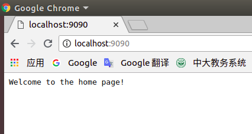
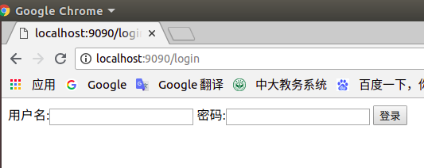
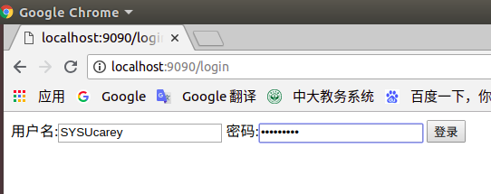
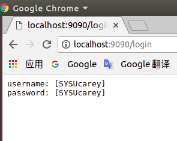

# [服务计算] 开发web服务程序cloudgo
## 项目概述

开发简单 web 服务程序 cloudgo，了解 web 服务器工作原理。

***

## 作业要求

1. 编程 web 服务程序 类似 cloudgo 应用。
   - 要求有详细的注释
   - 是否使用框架、选哪个框架自己决定 请在 README.md 说明你决策的依据

2. 使用 curl 测试，将测试结果写入 README.md

3. 使用 ab 测试，将测试结果写入 README.md。并解释重要参数。

***

## 相关知识

课件：

[http://blog.csdn.net/pmlpml/article/details/78404838](http://blog.csdn.net/pmlpml/article/details/78404838) 

[https://blog.csdn.net/pmlpml/article/details/78539261](https://blog.csdn.net/pmlpml/article/details/78539261) 

***

## 运行环境

- Unbuntu 18.04
- Golang

***

## 使用框架说明

- net/http

> Go语言里面提供了一个完善的net/http包，通过http包可以很方便的搭建起来一个可以运行的Web服务。同时使用这个包能很简单地对Web的路由，静态文件，模版，cookie等数据进行设置和操作。
>
> 参考：
>
> [1.Go用net/http搭建一个Web服务器](https://github.com/astaxie/build-web-application-with-golang/blob/master/zh/03.2.md) 
>
> [2.Go net/http包](https://studygolang.com/articles/9467)


- negroni库

> Negroni中间件库，是一个非常经典的库，非常小，但是功能强大，因为他定义了中间件的框架和风格，让我们可以基于它开发出我们自己的中间件，并且可以集成到Negroni中。
>
> Negroni还兼容原生的http.Handler,你完全可以把自己的http.Handler加入到Negroni的中间件链中，Negroni会自动调用他们处理我们的HTTP Request的。
>
> 参考：
>
> [1. GoDoc | negroni](https://godoc.org/gopkg.in/codegangsta/negroni.v0)
>
> [2. 飞雪无情的解析博客](http://www.flysnow.org/2017/08/20/go-classic-libs-negroni-one.html) 

## 运行说明

### 下载

```bash
go get -v github.com/SYSUcarey/cloudgo
```

### 运行

```bash
# 编译项目
$ go install github.com/SYSUcarey/cloudgo
# 运行项目
$ cloudgo -p 9090
```

或者进入项目根目录：`$GOPATH/src/github.com/SYSUcarey/clouodgo`

```bash
go run main.go -p 9090
```

### 效果

打开浏览器

1.

访问地址：

```
http://localhost:9090
```
服务器终端显示:

```bash
# bash 显示
[negroni] 2018-11-15T20:00:29+08:00 | 200 | 	 76.299µs | localhost:9090 | GET /
[negroni] 2018-11-15T20:02:18+08:00 | 200 | 	 22.475µs | localhost:9090 | GET /favicon.ico
```

浏览器截图：



2.

访问地址：

```
http://localhost:9090/login
```

浏览器截图：



服务器终端显示:

```bash
# bash 显示
method: GET
2018/11/15 20:21:00 <nil>
[negroni] 2018-11-15T20:21:00+08:00 | 200 | 	 221.272µs | localhost:9090 | GET /login
[negroni] 2018-11-15T20:21:00+08:00 | 200 | 	 27.092µs | localhost:9090 | GET /favicon.ico
```


3.

填写用户名:SYSUcarey，密码:SYSUcarey

点击登陆按钮






服务器终端显示:

```bash
# bash 显示
[negroni] 2018-11-15T20:11:01+08:00 | 200 | 	 254.965µs | localhost:9090 | GET /login
[negroni] 2018-11-15T20:11:03+08:00 | 200 | 	 31.219µs | localhost:9090 | GET /favicon.ico
method: POST
[negroni] 2018-11-15T20:14:07+08:00 | 200 | 	 134.198µs | localhost:9090 | POST /login
[negroni] 2018-11-15T20:14:07+08:00 | 200 | 	 34.33µs | localhost:9090 | GET /favicon.ico
```

***

## curl 测试

新开终端：

1.

测试指令:

```bash
$ curl -v http://localhost:8080
```

测试结果:

```bash
* Rebuilt URL to: http://localhost:9090/
*   Trying 127.0.0.1...
* TCP_NODELAY set
* Connected to localhost (127.0.0.1) port 9090 (#0)
> GET / HTTP/1.1
> Host: localhost:9090
> User-Agent: curl/7.58.0
> Accept: */*
> 
< HTTP/1.1 200 OK
< Date: Thu, 15 Nov 2018 12:23:28 GMT
< Content-Length: 26
< Content-Type: text/plain; charset=utf-8
< 
Welcome to the home page!
* Connection #0 to host localhost left intact

```

服务器终端输出:

```bash
# bash 显示
[negroni] 2018-11-15T20:29:24+08:00 | 200 | 	 15.266µs | localhost:9090 | GET /
```

2.

测试指令：

```bash
$ curl -v http://localhost:8080
```

测试结果：

```bash
* Rebuilt URL to: http://localhost:9090/
*   Trying 127.0.0.1...
* TCP_NODELAY set
* Connected to localhost (127.0.0.1) port 9090 (#0)
> GET / HTTP/1.1
> Host: localhost:9090
> User-Agent: curl/7.58.0
> Accept: */*
> 
< HTTP/1.1 200 OK
< Date: Thu, 15 Nov 2018 12:23:28 GMT
< Content-Length: 26
< Content-Type: text/plain; charset=utf-8
< 
Welcome to the home page!
* Connection #0 to host localhost left intact

```

服务器终端输出：

```bash
# bash 显示
[negroni] 2018-11-15T20:26:43+08:00 | 200 | 	 194.769µs | localhost:9090 | GET /login
```

***

## ab压力测试

### 安装apache2-utils

```bash
$ sudo apt install apache2-utils
```

### 测试

1.

测试指令：

```bash
$ ab -n 1000 -c 100 http://localhost:9090/
```

测试结果：

```bash
This is ApacheBench, Version 2.3 <$Revision: 1807734 $>
Copyright 1996 Adam Twiss, Zeus Technology Ltd, http://www.zeustech.net/
Licensed to The Apache Software Foundation, http://www.apache.org/

Benchmarking localhost (be patient)
Completed 100 requests
Completed 200 requests
Completed 300 requests
Completed 400 requests
Completed 500 requests
Completed 600 requests
Completed 700 requests
Completed 800 requests
Completed 900 requests
Completed 1000 requests
Finished 1000 requests


Server Software:        
Server Hostname:        localhost
Server Port:            9090

Document Path:          /
Document Length:        26 bytes

Concurrency Level:      100
Time taken for tests:   0.055 seconds
Complete requests:      1000
Failed requests:        0
Total transferred:      143000 bytes
HTML transferred:       26000 bytes
Requests per second:    18199.36 [#/sec] (mean)
Time per request:       5.495 [ms] (mean)
Time per request:       0.055 [ms] (mean, across all concurrent requests)
Transfer rate:          2541.51 [Kbytes/sec] received

Connection Times (ms)
              min  mean[+/-sd] median   max
Connect:        0    1   1.8      1       9
Processing:     0    4   1.9      3      10
Waiting:        0    3   1.7      3       8
Total:          1    5   2.9      4      15

Percentage of the requests served within a certain time (ms)
  50%      4
  66%      5
  75%      5
  80%      6
  90%     11
  95%     13
  98%     14
  99%     14
 100%     15 (longest request)
```

2.

测试指令：

```bash
ab -n 1000 -c 100 http://localhost:9090/login
```

测试结果：

```bash
This is ApacheBench, Version 2.3 <$Revision: 1807734 $>
Copyright 1996 Adam Twiss, Zeus Technology Ltd, http://www.zeustech.net/
Licensed to The Apache Software Foundation, http://www.apache.org/

Benchmarking localhost (be patient)
Completed 100 requests
Completed 200 requests
Completed 300 requests
Completed 400 requests
Completed 500 requests
Completed 600 requests
Completed 700 requests
Completed 800 requests
Completed 900 requests
Completed 1000 requests
Finished 1000 requests


Server Software:        
Server Hostname:        localhost
Server Port:            9090

Document Path:          /login
Document Length:        253 bytes

Concurrency Level:      100
Time taken for tests:   0.073 seconds
Complete requests:      1000
Failed requests:        0
Total transferred:      370000 bytes
HTML transferred:       253000 bytes
Requests per second:    13725.33 [#/sec] (mean)
Time per request:       7.286 [ms] (mean)
Time per request:       0.073 [ms] (mean, across all concurrent requests)
Transfer rate:          4959.35 [Kbytes/sec] received

Connection Times (ms)
              min  mean[+/-sd] median   max
Connect:        0    1   0.5      0       3
Processing:     0    6   3.3      6      18
Waiting:        0    6   3.4      6      15
Total:          0    7   3.2      7      19
WARNING: The median and mean for the initial connection time are not within a normal deviation
        These results are probably not that reliable.

Percentage of the requests served within a certain time (ms)
  50%      7
  66%      9
  75%      9
  80%     10
  90%     12
  95%     13
  98%     13
  99%     14
 100%     19 (longest request)
```

### 参数解释

#### 命令参数

>-n 执行的请求数量
>-c 并发请求个数
>-t 测试所进行的最大秒数
>-p 包含了需要POST的数据的文件
>-T POST数据所使用的Content-type头信息
>-k 启用HTTP KeepAlive功能，即在一个HTTP会话中执行多个请求，默认时，不启用KeepAlive功能

#### 结果参数

> Server Software:		服务器软件版本
> Server Hostname:		请求的URL
> Server Port:                	请求的端口号
>
> Document Path:        	请求的服务器的路径
> Document Length:       	页面长度   单位是字节
>
> Concurrency Level:            	并发数
> Time taken for tests:   		一共使用了的时间  
> Complete requests:           	总共请求的次数
> Failed requests:   			失败的请求次数     
>
> Total transferred:   		总共传输的字节数  http头信息
> HTML transferred:    		实际页面传递的字节数
> Requests per second:    	每秒多少个请求
> Time per request:   		平均每个用户等待多长时间
> Time per request: 		服务器平均用多长时间处理
> Transfer rate: 			传输速率
>
> Connection Times: 		传输时间统计
>
> Percentage of the requests served within a certain time:	
> 确定时间内服务请求占总数的百分比
